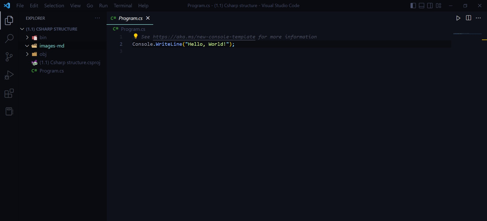
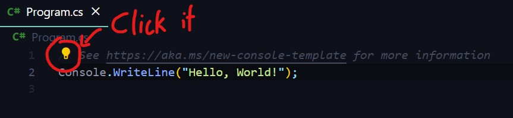
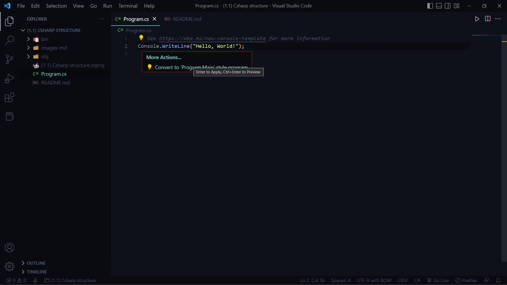
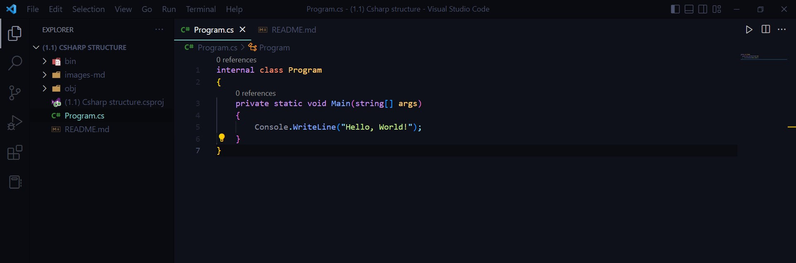

# The strcuture of C#

## TASK: try creating a new project and take a look at Program.cs

if you still remember the process, it's

```
dotnet new console
```
at the terminal

Now look closely at Program.cs



it's just 2 lines, very short. As of this project, C# has evolved to version 6.0 which leads to C# looking a bit like python, no structure, class, etc.

oh? wonder what class or structures are? well they are something like this:

```csharp
using System;

class Program{
    public static void main(string[] args){
        Console.WriteLine("hello world");
    }
}
```

In fact, if you try coming across tutorials of C#, you will notice they use something like this as well.

But no problem, you can actually change them from the .csproj and a few things.



see that lightbulb? click it and a menu should appear (if there is none, press ctrl + . )



click the one and only option

and you should see this:



## The structure

let's take a look at the C# structure

```csharp
internal class Program
{
    private static void Main(string[] args)
    {
        Console.WriteLine("Hello, World!");
    }
}
```

we will learn more about internal and private, but just bear in mind that this is how most C# code looks like, it has a class, which contains main with string[] args which contains whatever code you need to run.

If it feels confusing, imagine it as some magic words to cast a spell, to make the program work.
