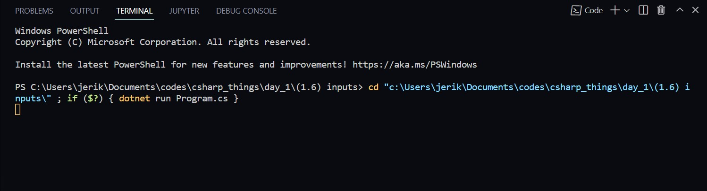
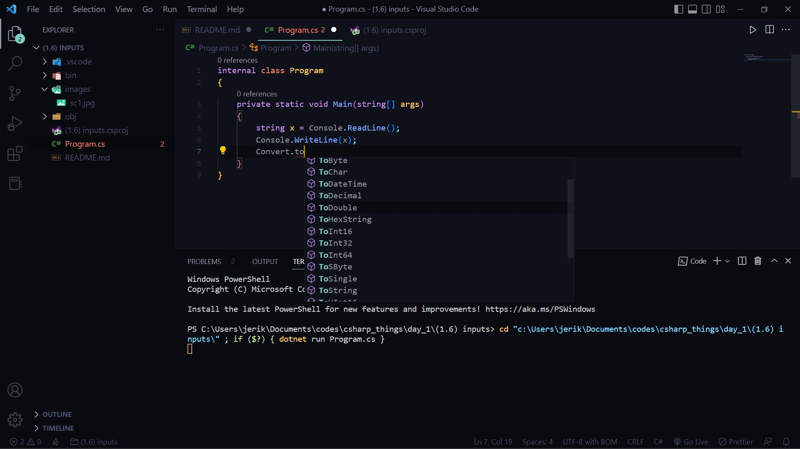

# Inputs

it's time to learn how to take inputs

the command to take inputs is:

```
Console.ReadLine();
```

use this and store it in a variable and output it.

example: 

```
string x = Console.ReadLine();
Console.WriteLine(x);
```

as you run the program, it won't continue until you type something in it(awaits input)



output:
```
hi
hi
```

## this only takes strings, numbers or anything inputted gets converted to string

so what if you want numbers instead?

to do that, you need to type cast them (convert them)

```csharp
int x = Convert.toInt32(Console.ReadLine());
Console.WriteLine(x);
```

output:
```
12
12
```

Many conversion types, you will definitely find them



that's all about it for basic inputs, now you have all you need for the project

