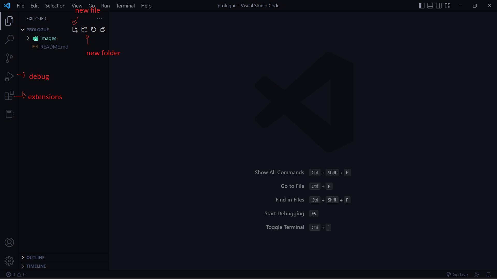
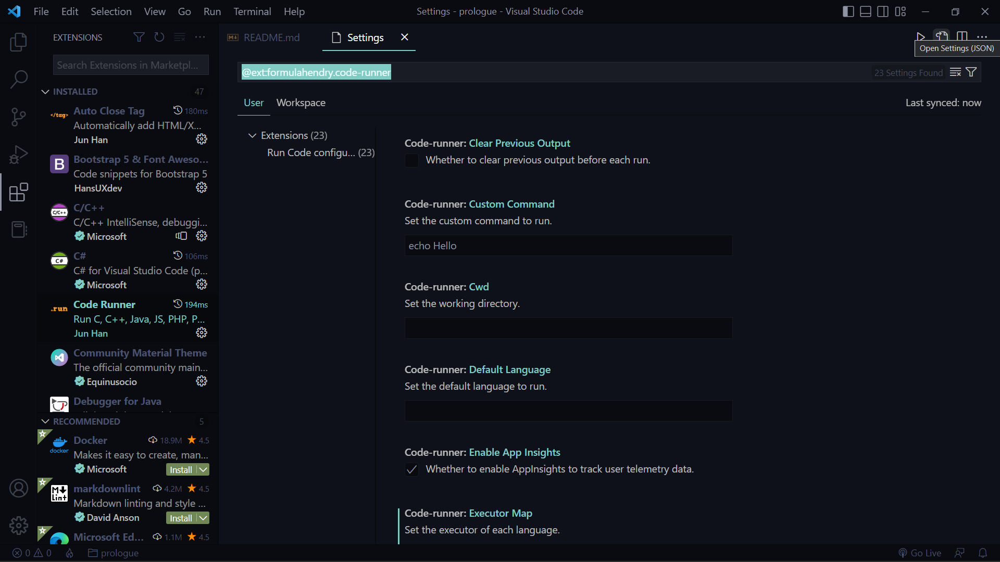
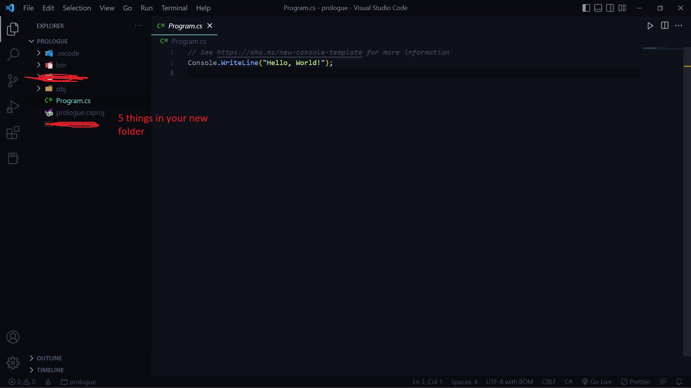
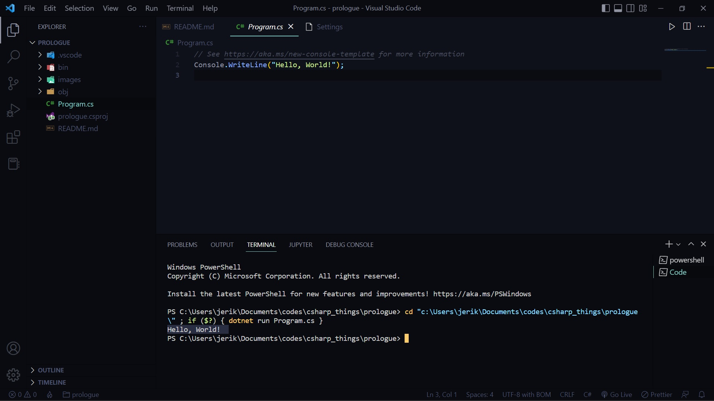

# Before you start, few things to do

you will need a text editor or an IDE*

*integrated development environment (a specific software for a specific purpose)

for this approach I will be using a text editor, visual studio code

The reason is because this text editor is expendable, in case you got bored with C#, you can expand it to 
others like python, C++, etc.

# Process

## Download visual studio code

https://code.visualstudio.com/

click the link and just follow the procedures


There will be an option for this as well

- create a desktop icon (optional)
- add "Open with code" to file (edit file with code, optional)
- add "Open with code" to directory (edit folder with code, optional)
- register code as an editor (able to detect code files, MUST)
- add to PATH (MUST)

Once you are done, feel free to look around and get yourself comfy, you will be using it a lot

decorate it, give it some colors, add extensions



## download C# extension and a code runner

Head over to the extensions tab (or use ctrl + shift + X)

search for C# and a code runner


this will install a play button on your top right corner to run your program

additionally you will need to configure code runner a bit as it will not run C# until it receives a change in commands

go to code runner -> click the gear icon (extension settings) then go click open json settings



many codes there, but you only need to change one, find csharp then replace it with this:

```
"csharp": "cd $dir && dotnet run $fileName"
```

you still can't write or run any C# code yet, you are missing one more thing

## download C# itself

got the body and tools, just missing the core

https://dotnet.microsoft.com/en-us/download

download .NET SDK x64, as of this project it is currently .NET 6.0

follow through the installations and you are done

## try your first C# project

now to see if it actually works

create a new folder and open it with vs code

click on terminal on the top menu, then click new terminal

in your terminal type in 

```
dotnet new console
```

a project should be created, also allow for additional files to be add, your project structure should look something like this:



now try clicking the play button



if that is the result you get, you should be ready to start learning C#


